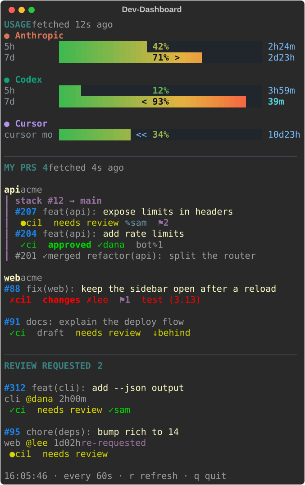

# Dev-Dashboard _(devdash)_

[](https://github.com/shayan-ys/devdash/actions/workflows/ci.yml)
[](pyproject.toml)
[](LICENSE)

A narrow terminal dashboard for GitHub PRs, GitHub stacks (gh-stack), reviews, and OMP AI usage.



Keep Dev-Dashboard open in a side split of tmux, Ghostty, WezTerm, or any terminal. It answers the
questions you would otherwise open five browser tabs for: which PR is red, which one is approved,
who still has to review, and what waits on you. The repository, package, and command are all
named `devdash`.

- **Your PRs, grouped the way you work.** Grouped by repository. Stacks made with
  [gh-stack](https://github.com/github/gh-stack) are drawn top to bottom, including merged layers.
  Plain branch chains (a PR whose base is another of your PRs) are drawn as stacks too.
- **Everything that blocks a merge, in one row.** CI (with the first failed check), draft, review
  decision, each reviewer's latest verdict, bot reviews, unresolved threads, conflicts, behind-base,
  and merge-queue position.
- **Review requests.** PRs that wait for you, newest first, with the author and age, and a marker
  when someone requests your review again.
- **OMP AI usage (optional).** Rate-limit bars and reset countdowns for every provider that
  the [OMP](https://omp.sh) coding agent tracks. Hidden when `omp` is not installed.
- **Hide what you do not want to see.** Exclude single repositories or whole organizations.

PR numbers are clickable in terminals that support hyperlinks.

<br clear="right">

## Contents

- [Install](#install)
- [Usage](#usage)
- [Configuration](#configuration)
- [Troubleshooting](#troubleshooting)
- [Related projects](#related-projects)
- [Contributing](#contributing)
- [License](#license)

## Install

You need Python 3.12 or later and the [GitHub CLI](https://cli.github.com), signed in:

```sh
gh auth login
```

Then install devdash with [uv](https://docs.astral.sh/uv/) or [pipx](https://pipx.pypa.io):

```sh
uv tool install git+https://github.com/shayan-ys/devdash
# or
pipx install git+https://github.com/shayan-ys/devdash
```

`devdash.py` is also a self-contained script. It declares its dependencies inline
([PEP 723](https://peps.python.org/pep-0723/)), so with uv installed you can copy one file:

```sh
curl -fsSLo ~/.local/bin/devdash https://raw.githubusercontent.com/shayan-ys/devdash/main/devdash.py
chmod +x ~/.local/bin/devdash
```

To update, run `uv tool upgrade devdash` (or `pipx upgrade devdash`), or download the file again.

## Usage

```sh
devdash                            # live view; press r to refresh now, q to quit
devdash --once                     # print one frame and exit
devdash --exclude acme/monorepo    # hide one repository
devdash --exclude acme             # hide every repository of a user or organization
devdash --no-review --no-usage     # show only your own PRs
devdash --help                     # all flags
```

`--once` is also the behavior when standard input is not a terminal, so `devdash | less -R` works.

### Status row legend

|Mark|Meaning|
|---|---|
|`✓ci` `●ci2` `✗ci1`|Checks passed, 2 still running, 1 failed (the first failed check is named at the end of the row)|
|`approved` `changes` `needs review`|The PR's review decision|
|`✓dana` `✗lee` `✎sam`|A reviewer's latest review: approved, requested changes, commented|
|`bot✎2`|Reviews from 2 bots|
|`⚑3`|3 unresolved review threads|
|`⚠conflict` `↓behind`|Merge conflict, or the branch is behind its base|
|`⇢queued #2`|Position in the merge queue|

## Configuration

Every setting is optional. devdash reads a [TOML](https://toml.io) file from the first of:

1. `--config PATH`
2. `$DEVDASH_CONFIG`
3. `$XDG_CONFIG_HOME/devdash/config.toml`, which is usually `~/.config/devdash/config.toml`

```toml
interval = 60                    # seconds between refreshes

[github]
exclude = ["acme/monorepo", "some-org"]   # "owner/repo", or "owner" for all of its repositories
review_requested = true          # show the REVIEW REQUESTED section

[usage]
enabled = "auto"                 # true, false, or "auto" (only when omp is installed)
refetch_after = 180              # force a fresh usage read after this many seconds; 0 = never
order = ["openai-codex", "anthropic"]

[usage.names]
anthropic = "Claude"

[usage.colors]
anthropic = "#d97757"
```

Command-line flags override the file, and each `--exclude` adds to `github.exclude`. An unknown
key or a value of the wrong type stops devdash with an error, so a typo cannot fail silently.
[`config.example.toml`](config.example.toml) lists every key with its default.

## Troubleshooting

**`gh is not signed in`.** Run `gh auth login`. devdash uses the account that `gh` uses; with
more than one account, `gh auth switch` selects it.

**A PR is missing.** devdash shows the first 50 open PRs you wrote and the first 50 that request
your review. Excluded repositories do not count toward the 50.

**Stacks are shown as `chain → main` instead of `stack #N`.** The PRs were not made with
gh-stack, or your GitHub host does not provide stack data (for example, GitHub Enterprise Server).
devdash then rebuilds stacks from branch chains.

**The usage section shows `last read … ago`.** Some providers rate-limit their usage endpoints,
and omp then drops the provider from its report. devdash keeps the last good read, marks it stale,
and saves it in `$XDG_CACHE_HOME/devdash/`. To make fewer requests, raise `refetch_after` or use
`--cached`.

## Related projects

- [gh-dash](https://github.com/dlvhdr/gh-dash) is a full-screen, interactive dashboard for PRs
  and issues. Use it to act on PRs. Use devdash to watch them from a narrow pane.
- [gh-stack](https://github.com/github/gh-stack) creates and manages the stacks that devdash draws.

## Contributing

Questions, bug reports, and pull requests are welcome. Please
[open an issue](https://github.com/shayan-ys/devdash/issues) first for a large change.
[CONTRIBUTING.md](CONTRIBUTING.md) explains the local setup, and everyone who takes part agrees to
the [Code of Conduct](CODE_OF_CONDUCT.md). Report security problems as described in
[SECURITY.md](SECURITY.md).

## License

[MIT](LICENSE) © Shayan
