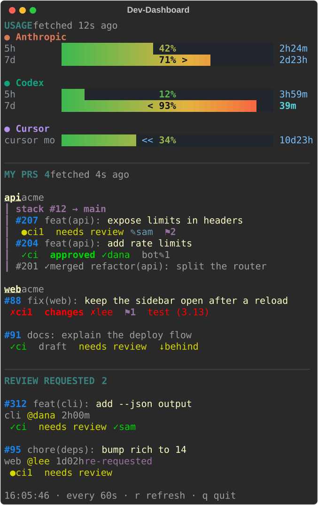

# Dev-Dashboard _(devdash)_

[](https://github.com/shayan-ys/devdash/actions/workflows/ci.yml)
[](pyproject.toml)
[](LICENSE)

A narrow terminal dashboard for GitHub PRs, GitHub stacks (gh-stack), reviews, and OMP AI usage.



Keep Dev-Dashboard open in a side split of tmux, Ghostty, WezTerm, or any terminal. It answers the
questions you would otherwise open five browser tabs for: which PR is red, which one is approved,
who still has to review, and what waits on you. The repository, package, and command are all
named `devdash`.

- **Your PRs, grouped the way you work.** Grouped by repository. Stacks made with
  [gh-stack](https://github.com/github/gh-stack) are drawn top to bottom, including merged layers.
  Plain branch chains (a PR whose base is another of your PRs) are drawn as stacks too.
- **Everything that blocks a merge, in one row.** CI (with the first failed check), draft, review
  decision, each reviewer's latest verdict, bot reviews, unresolved threads, conflicts, behind-base,
  and merge-queue position.
- **Review requests.** PRs that wait for you, newest first, with the author and age, and a marker
  when someone requests your review again.
- **OMP AI usage (optional).** Rate-limit bars and reset countdowns for providers with
  usage reports in the selected [OMP](https://omp.sh) profile. OpenRouter spend and remaining
  credits are read from its [key](https://openrouter.ai/docs/api/api-reference/api-keys/get-current-api-key)
  and [credits](https://openrouter.ai/docs/api/api-reference/credits/get-credits) endpoints.
  Nous Portal credits are read from the Portal account API when omp has a `nous-portal` or
  `nous` credential. Hidden when `omp` is not installed. Weekly and monthly bars show a pace
  icon (`>>` too fast, `<<` too slow, `|` on pace).
- **Hide what you do not want to see.** Exclude single repositories or whole organizations.
- **Your own sections.** Add as many custom integrations as you like (weather, service health,
  a tutor, a build queue): any command whose output devdash shows in a slot you choose.

PR numbers are clickable in terminals that support hyperlinks.

<br clear="right">

## Contents

- [Install](#install)
- [Usage](#usage)
- [Configuration](#configuration)
- [Custom integrations](#custom-integrations)
- [Troubleshooting](#troubleshooting)
- [Related projects](#related-projects)
- [Contributing](#contributing)
- [License](#license)

## Install

You need Python 3.12 or later and the [GitHub CLI](https://cli.github.com), signed in:

```sh
gh auth login
```

Then install devdash with [uv](https://docs.astral.sh/uv/) or [pipx](https://pipx.pypa.io):

```sh
uv tool install git+https://github.com/shayan-ys/devdash
# or
pipx install git+https://github.com/shayan-ys/devdash
```

`devdash.py` is also a self-contained script. It declares its dependencies inline
([PEP 723](https://peps.python.org/pep-0723/)), so with uv installed you can copy one file:

```sh
curl -fsSLo ~/.local/bin/devdash https://raw.githubusercontent.com/shayan-ys/devdash/main/devdash.py
chmod +x ~/.local/bin/devdash
```

To update, run `uv tool upgrade devdash` (or `pipx upgrade devdash`), or download the file again.

## Usage

```sh
devdash                            # live view; press r to refresh now, q to quit
devdash --once                     # print one frame and exit
devdash --exclude acme/monorepo    # hide one repository
devdash --exclude acme             # hide every repository of a user or organization
devdash --no-review --no-usage     # show only your own PRs
devdash --no-integration weather   # hide one custom integration (--no-integrations hides all)
devdash --profile personal --once  # show usage from the personal omp profile
devdash --github alice             # MY PRS / REVIEW REQUESTED for this gh login
devdash --help                     # all flags
```

`--once` is also the behavior when standard input is not a terminal, so `devdash | less -R` works.
`--profile NAME` uses the same isolated auth, settings, and usage cache as `omp --profile NAME`.
Without the flag, devdash follows omp's default profile (or `$OMP_PROFILE`). Usage from one
profile is never reused as the last-good reading for another. Providers with an authenticated
account but no available usage data appear under `no data`. With `--profile`, each provider
heading includes that provider's account email in white, for example `Codex (user@example.com)`.

`--github USER` is the GitHub username from `gh auth status` (not an email). It scopes MY PRS
and REVIEW REQUESTED to that login without running `gh auth switch`. It does not label usage.

OpenRouter shows **per-key** spending, not your overall account balance. An API key limit
appears as a spend bar; an unlimited key shows dollars spent. If its key is not available
through `omp token openrouter`, or OpenRouter rejects it, the provider stays hidden.
Nous Portal has no published read-only usage/balance API; view its usage at
[Nous subscription management](https://portal.nousresearch.com/manage-subscription).

### Status row legend

|Mark|Meaning|
|---|---|
|`✓ci` `●ci2` `✗ci1`|Latest run of each check passed, 2 still running, 1 failed (the first failed check is named at the end of the row)|
|`approved` `changes` `needs review`|The PR's review decision|
|`✓dana` `✗lee` `✎sam`|A reviewer's latest review: approved, requested changes, commented|
|`bot✎2`|Reviews from 2 bots|
|`⚑3`|3 unresolved review threads|
|`⚠conflict` `↓behind`|Merge conflict, or the branch is behind its base|
|`⇢queued #2`|Position in the merge queue|

### Usage pace

Weekly and monthly bars have a pace icon beside the percentage: fast and on-pace icons on its
right, slow icons on its left. It compares the share of
the quota you used with the share of the window that has passed. For example, 34% used with
19 of 30 days gone (63%) is 29 points slow: `<<`.

|Icon|Points from pace|Meaning|
|---|---|---|
|`\|`|less than 5|On pace|
|`>` `>>` `>>>`|5, 15, 30 or more ahead|Too fast; `>>>` runs out well before the reset|
|`<` `<<` `<<<`|5, 15, 30 or more behind|Too slow; you have quota to spare|

There is no icon on 5-hour windows, or in the first 10% (at least 12 hours) of a window,
where one busy hour looks like a runaway pace. Set `usage.pace = false` to hide the icons.

## Configuration

Every setting is optional. devdash reads a [TOML](https://toml.io) file from the first of:

1. `--config PATH`
2. `$DEVDASH_CONFIG`
3. `$XDG_CONFIG_HOME/devdash/config.toml`, which is usually `~/.config/devdash/config.toml`

```toml
interval = 60                    # seconds between refreshes

[github]
exclude = ["acme/monorepo", "some-org"]   # "owner/repo", or "owner" for all of its repositories
review_requested = true          # show the REVIEW REQUESTED section

[usage]
enabled = "auto"                 # true, false, or "auto" (only when omp is installed)
refetch_after = 180              # force a fresh usage read after this many seconds; 0 = never
pace = true                      # pace icons (> fast, < slow, | on pace) on weekly and monthly bars
order = ["openai-codex", "anthropic"]

[usage.names]
anthropic = "Claude"

[usage.colors]
anthropic = "#d97757"
```

Command-line flags override the file, and each `--exclude` adds to `github.exclude`. An unknown
key or a value of the wrong type stops devdash with an error, so a typo cannot fail silently.
[`config.example.toml`](config.example.toml) lists every key with its default.

## Custom integrations

An integration is your own section. Declare one `[[integrations]]` table per section; there is
no limit on how many. devdash runs each one's command and shows what it prints to standard
output, under a heading:

```toml
[[integrations]]
name = "weather"                    # required; unique; used by --no-integration
title = "WEATHER"                    # heading; defaults to the name in capitals
command = ["curl", "-fsS", "https://wttr.in/Toronto?format=3"]
position = "top"                     # top, after-usage, after-my-prs, or bottom (the default)
interval = 900                       # seconds between runs, up to 86400; 0 (the default) uses the global interval
timeout = 10                         # seconds, 1 to 86400, before the command and its children are killed
max_rows = 20                        # longer output is cut, ending in "… N more rows"
enabled = true                       # false keeps the table but hides the section
env = { WTTR_LANG = "en" }           # extra environment variables for the command
```

Integrations that share a position appear in the order they are listed in the file.

**What a command must do.** Print the section body and exit with status 0. Any language works:
a shell script, a Python file, or an existing CLI with a one-shot mode. devdash sets `COLUMNS`
to the pane width and `LINES` to `max_rows`, so the command can fit its output to the room it has;
when the pane is resized, devdash runs every waiting integration again at once (one that is
already running finishes first). Colors (SGR) and hyperlinks (OSC 8) are kept. Cursor movement,
screen clears, and every other escape sequence are dropped, and any other control character
shows as `�`. A link whose target contains a control character loses its link. Rows longer
than the pane end in `…`. Trailing blank rows are removed. devdash keeps
the first 64 KiB of standard output: a command that prints more is stopped there, and that part
is shown. Of standard error it keeps only the last 4 KiB, so a noisy command cannot use up memory.

**Failures.** A non-zero exit, a timeout, or a command that cannot start shows `⚠` and the
reason under the heading: for a non-zero exit, the last line of its standard error, as plain
text. The last good output stays on screen below the error, and the heading tells you how old it is.

**Safety.** An integration runs with your user's rights. Only list commands you trust.
devdash runs the `command` list directly, without a shell; to use pipes or `&&`, write
`["sh", "-c", "…"]` or point at a script. The first element may start with `~`. Each
integration runs on its own thread, with no standard input and in its own process group, so a
slow or hung command cannot freeze the dashboard or read your keystrokes. A timeout kills the
command together with every process it started that stayed in its process group; a program
that starts its own session (a daemon, for example) escapes this. Quitting devdash, with `q`,
Ctrl-C, or by closing the pane, kills running commands the same way. Pressing `r` runs every
waiting integration again at once. With `--once`, devdash runs all integrations in parallel,
each within its own timeout, alongside the built-in GitHub and usage reads.

### Example: prompt-tutor

[prompt-tutor](https://github.com/shayan-ys/prompt-tutor) reviews the English of the prompts you
send to omp, and its Watcher shows the latest Review. Its one-shot mode, `prompt-tutor --once`,
prints one frame sized to `COLUMNS` and `LINES` and exits, so it works as an integration as is.

1. Install prompt-tutor and put its Watcher on your `PATH`, as its
   [install instructions](https://github.com/shayan-ys/prompt-tutor#install) describe
   (`omp plugin install github:shayan-ys/prompt-tutor`, restart omp, then run
   `/prompt-tutor install-watcher` inside omp).
2. Check that the frame fits a narrow pane:

   ```sh
   COLUMNS=50 LINES=16 prompt-tutor --once < /dev/null | cat
   ```

3. Add it to your devdash config (`~/.config/devdash/config.toml` by default), here at the bottom:

   ```toml
   [[integrations]]
   name = "prompt-tutor"
   title = "PROMPT TUTOR"
   command = ["prompt-tutor", "--once"]
   position = "bottom"
   max_rows = 16
   ```

   If devdash shows `⚠ cannot run prompt-tutor`, the Watcher link is not on the `PATH` that
   devdash sees; use its full path, for example `command = ["~/.local/bin/prompt-tutor", "--once"]`.
4. Run `devdash`. The section updates on the global interval; press `r` to refresh it after a
   prompt, and use `devdash --no-integration prompt-tutor` to hide it for one run.

The frame's last row lists the Watcher's own keys (`j/k`, `s`, `q`). They work only in the
standalone `prompt-tutor` Watcher, not inside devdash.

## Troubleshooting

**`gh is not signed in`.** Run `gh auth login`. With more than one account, pass `--github USER`
(the username from `gh auth status`) or set `github.account` in the config file.

**A PR is missing.** devdash shows the first 50 open PRs you wrote and the first 50 that request
your review. Excluded repositories do not count toward the 50.

**Stacks are shown as `chain → main` instead of `stack #N`.** The PRs were not made with
gh-stack, or your GitHub host does not provide stack data (for example, GitHub Enterprise Server).
devdash then rebuilds stacks from branch chains.

**The usage section shows `last read … ago`.** Some providers rate-limit their usage endpoints,
and omp then drops the provider from its report. devdash keeps the last good read, marks it stale,
and saves it in `$XDG_CACHE_HOME/devdash/`. To make fewer requests, raise `refetch_after` or use
`--cached`.

**OpenRouter is missing.** `omp usage` does not report every configured model provider.
devdash queries OpenRouter's per-key usage and remaining-credits APIs with the key returned by
`omp --profile NAME token openrouter`; the key stays in memory and is never saved in
the dashboard cache. Check that the key belongs to the selected profile and remains valid.

**Nous Portal is missing.** Portal credits are not part of `omp usage`. devdash calls
`https://portal.nousresearch.com/api/oauth/account` with `omp --profile NAME token nous-portal`
(or `nous`). A browser or Hermes login is not visible to omp; store the Portal credential in
the selected omp profile first. Inference keys that cannot read the account API are omitted.

**An integration shows `⚠ exit 127` or `cannot run …`.** devdash could not find the command.
Use an absolute path, or check that the program is on the `PATH` that devdash sees.

**An integration's layout is broken.** The command probably draws for a full-screen terminal.
Run it as devdash does, for example `COLUMNS=50 LINES=20 your-command < /dev/null | cat`, and
check that it fits. A command that sizes itself from the terminal must fall back to `COLUMNS`
and `LINES` when its output is a pipe.

## Related projects

- [gh-dash](https://github.com/dlvhdr/gh-dash) is a full-screen, interactive dashboard for PRs
  and issues. Use it to act on PRs. Use devdash to watch them from a narrow pane.
- [gh-stack](https://github.com/github/gh-stack) creates and manages the stacks that devdash draws.

## Contributing

Questions, bug reports, and pull requests are welcome. Please
[open an issue](https://github.com/shayan-ys/devdash/issues) first for a large change.
[CONTRIBUTING.md](CONTRIBUTING.md) explains the local setup, and everyone who takes part agrees to
the [Code of Conduct](CODE_OF_CONDUCT.md). Report security problems as described in
[SECURITY.md](SECURITY.md).

## License

[MIT](LICENSE) © Shayan
